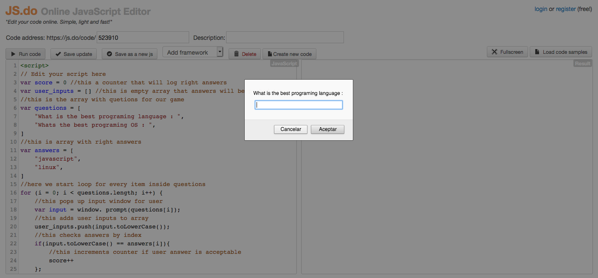

# JS alert window with counter



*Check the feature branch for up to date commits*

## Objectives

1. Get user input.
2. Store user input.
3. Check input with conditionals. 


### Project Structure

```bash

├── javascript_counter
│   └── counter.js


```

## Built With

- JavaScript, JS.do website.


## What it does:

1. Stores inputs.
2. Runs loop and conditional.
3. Returns inputs array.
4. Returns score.

## Authors

👤 **Miguel Angel Enciso Sanchez**

- Github: [@rootDEV2990](https://github.com/rootDEV2990)
- Twitter: [@m29902](https://twitter.com/m29902)
- Linkedin: [linkedin](https://www.linkedin.com/in/miguel-enciso-6474741a1/)
- Medium: [medium](https://medium.com/@website.dev)

## 🤝 Contributing

Contributions, issues and feature requests are welcome!

Feel free to check the [issues page](issues/).

## Show your support

Give a ⭐️ if you like this project!

Bitcoin donations accepted ;)

1AD5ANtHmqemTZ2Qmv5UqJAMijTNyCAH8D 🚀
